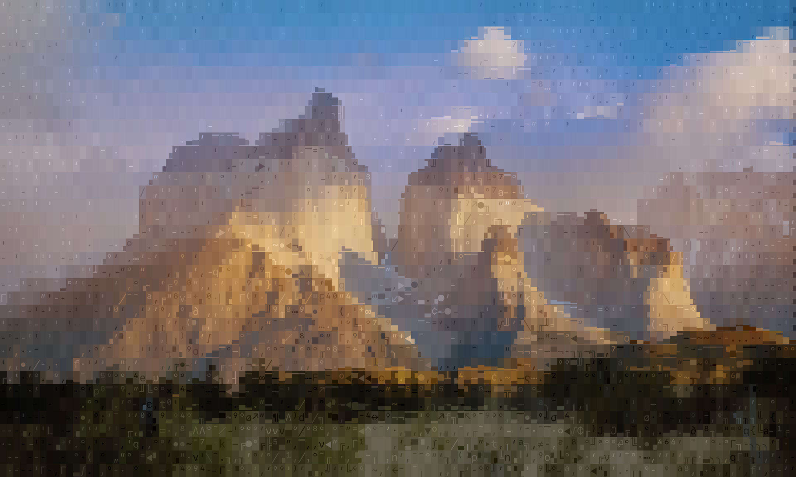

# UNICASSO

**Image → ASCII art by direct optimization.**

| line art | 60 columns | 40 columns |
|:---:|:---:|:---:|
|  |  |  |

The same image at two grid widths: features are re-resolved at each grid size.
The UNICASSO renders on this page were made with the `sfmono` kit and the CLIP
adapter switched on — otherwise default settings.

UNICASSO renders an image as a grid of monospace glyphs by optimizing the whole
grid jointly — a CLIP perceptual loss plus reconstruction and structural terms,
searched over a glyph-VAE latent space with per-cell populations of weighted
glyph candidates. No ASCII training data. Works with any monospace font via the bundled font-kit tooling; an
optional color mode fits per-cell foreground/background colors during
optimization.

> **Status: pre-release.** Paper writeup forthcoming.

## From photo to ASCII

Any image works as input, but the sweet spot is clean line art. The bundled
front-end converts photos with an image-editing model
(local [FLUX.2-klein](unicasso/lineart/klein_lineart.py) or the
[BFL API](unicasso/lineart/bfl_lineart.py)):

```bash
python -m unicasso.lineart.photo2line photo.jpg          # photo -> photo_line.png
GLYPHVAE_FONT=dejavu python -m unicasso.engine.asciify photo_line.png
```

| photo | line art |
|:---:|:---:|
|  |  |

With `--color`, the source is decomposed into an ink layer (which drives glyph
choice) and per-cell foreground/background colors fitted in closed form every
step — the colors you see are the colors that ship:

| source | ink target | glyphs alone | colored render |
|:---:|:---:|:---:|:---:|
|  |  |  |  |

Color runs get away with fewer iterations — the fitted colors carry much of
the image, so glyph placement matters less: `--color --iters 2000` is usually
plenty.

More in [`examples/`](examples/) (credits: [`examples/CREDITS.md`](examples/CREDITS.md)).

## How it compares

Same input, three approaches (for optimization targets see `examples/monochrome`):

| [gradscii-art](https://github.com/stong/gradscii-art) (softmax + reconstruction) | [DeepAA](https://github.com/OsciiArt/DeepAA) (learned per-cell classifier) | **UNICASSO** |
|:---:|:---:|:---:|
|  |  |  |
|  |  |  |
|  |  |  |

- **Softmax + reconstruction** — the approach this project began as an
  experiment on top of: relax the discrete choice to a temperature-annealed
  blend and descend a pixel loss. Reconstruction treats line art as *tone*, so
  strokes become block mush. (Rendered here by our archived
  [reference implementation](legacy/).)
- **DeepAA** — a CNN picks the best character per window, greedily. Clean
  contours where lines are simple, but no global objective: no emphasis, no
  tone, and busy regions degrade into locally-plausible debris.
- **UNICASSO** — global perceptual objective + discrete swarm search: lines
  route coherently *across* cells, tone and texture survive, and empty space
  stays empty.

The comparison is not compute-matched: DeepAA is a single feedforward pass,
the softmax baseline a few minutes of descent, UNICASSO about an hour of
optimization per image. The claim is about what a global objective reaches,
not about efficiency.

## Quick start

```bash
pip install -e .
unicasso path/to/image.jpg                 # or: python -m unicasso.engine.asciify
```

That is the whole command — **the defaults are the canonical recipe** (the
~100-flag invocation these renders were developed with), recorded in
[`canonical_recipe.args`](unicasso/engine/canonical_recipe.args) and enforced by
`python -m unicasso.engine.test_recipe`. A render is ~1 h on an M-series Mac at
the default 3500 iterations (~2 h with the adapter). For a fast preview:

```bash
unicasso image.jpg --iters 300 --progress-every 25    # rough sketch in minutes,
                                                      # state snapshots in <out>_progress/
```

Useful flags: `--color`, `--qr`, `--seed`, `--output-text out.txt`. The `.txt`
files next to the renders in [`examples/`](examples/) are actual outputs.

**Model downloads.** The first run fetches CLIP RN101 (~280 MB). The affinity
term uses DINOv3, which is gated on HuggingFace (accept the licence at
[facebook/dinov3-vitb16-pretrain-lvd1689m](https://huggingface.co/facebook/dinov3-vitb16-pretrain-lvd1689m)
then `huggingface-cli login`); **if that download fails the run continues**
without affinity, after a loud warning. Minimum working install: torch + RN101,
no HuggingFace account.

On stock Ubuntu, the distro's system Pillow (9.0.x in `dist-packages`) can
shadow pip's and break both font rendering and the lineart tools — if you see
`Resampling` or fractional-font-size errors, `pip install -U pillow` fixes it.

**Font kits.** `dejavu` (DejaVu Sans Mono, bundled, OFL) is the default and
fully redistributable; its glyph-VAE ships in `weights/vae_dejavu/`. On a Mac,
the `sfmono` kit uses Terminal's own SF Mono — the natural choice if the art
will live in your terminal (metadata-only kit; Apple's font is not
redistributable, so it works on a Mac and nowhere else):

```bash
GLYPHVAE_FONT=sfmono python -m unicasso.engine.asciify path/to/image.jpg
```

Each kit's `profile.json` carries the handful of genuinely
font-dependent settings. To onboard your own monospace font — build a kit,
curate a charset, train its VAE — follow **[docs/fonts.md](docs/fonts.md)**.

**CLIP domain adaptation (optional).** `weights/clip_adapter/` ships adapters
that shift CLIP toward ASCII renders — off by default (mainly speed), worth
enabling if you see lines overshooting their endpoints. The shipped pair was
trained on SF Mono renders, so it pairs naturally with the `sfmono` kit:

```bash
GLYPHVAE_FONT=sfmono python -m unicasso.engine.asciify path/to/image.jpg \
    --clip-adapter weights/clip_adapter/adapters_step500.pt
```

To retrain on your own corpus (or another font's native renders), follow
**[docs/adapter.md](docs/adapter.md)**.

## Layout

- `unicasso/` — the package: `engine/` (optimizer: asciify, swarm, pool, CLIP
  stack, color), `substrate/` (glyphs, rasterizer, VAE model, font_kit),
  `training/` (glyph-VAE trainer), `adapter/` (CLIP domain adaptation),
  `output/` (recolor/colorize tools), `lineart/` (photo→line front-ends),
  `curation/` (glyph curation GUIs), `artcode/` (QR codes that carry the art).
- `kits/` — font kits (charset, cell geometry, per-font recipe block).
- `weights/` — glyph-VAE checkpoints + the optional CLIP adapter (small, committed).
- `docs/` — [font onboarding](docs/fonts.md), [adapter training](docs/adapter.md).
- `legacy/` — archived reference implementations discussed in the paper.

## How it works

A **glyph-VAE** embeds every glyph of the active font as a point in a small
latent space, giving the discrete charset a geometry: perceptually similar
glyphs are near each other, and a grid cell's choice becomes a continuous
latent that softly blends its nearest glyphs. The **soft render** of all cells
is scored by the objectives — random-crop CLIP passes (with a dense
fully-convolutional sweep), multiscale reconstruction, and structural terms
(orientation, coordinate priors, emptiness handling) — and gradients flow back
to every cell at once. On top of the gradient flow runs a **discrete economy**:
each cell keeps a small swarm of candidate slots with learned arbitration
weights; proposal channels (latent neighbors, blend residuals, edge
continuity with neighboring glyphs, joins, pixel evidence) nominate alternative glyphs, and a **live
probe** measures each nomination by actually swapping it into the render —
only measured improvements are admitted. Temperature and weight schedules
anneal the whole system from exploration to commitment, and the final grid is
the hard argmax that the consistency terms have been pulling the soft state
toward all along. With `--color`, per-cell fg/bg colors are the closed-form
least-squares fit to the target under the current glyph — recomputed every
step, so color is optimized *with* the glyphs, not painted on after.

This is a heavy simplification — and the schedules carry real weight: what
anneals when (temperatures, weight caps, noise, loss ramps) shapes the search
as much as the loss terms do. The latent-structuring objectives the VAE is
trained with, the loss terms that exploit that structure (e.g. the coordinate
readout), the size-weighted crop sampling in the CLIP passes, the
admission/eviction rules, and the schedule design are detailed in the
forthcoming paper. Until then, the most complete technical description in the
repo is the module docstring of
[`unicasso/engine/swarm.py`](unicasso/engine/swarm.py) — it derives the
slot parameterization from the failure mode of its predecessor. Start there.

## artcode

Pass `--qr` to also emit a QR code linking to the image, or encode an existing
`.txt` directly:

```bash
pip install segno                                     # or: pip install -e '.[qr]'
python -m unicasso.engine.asciify photo.jpg --qr                # QR in the terminal
python -m unicasso.artcode art.txt --png code.png               # from a .txt
```

The QR's URL carries the artwork itself in the fragment (~300 bytes after
compression: an order-2 context model + range coder); the linked page decodes
it client-side. Format and measurements:
[`unicasso/artcode/README.md`](unicasso/artcode/README.md).

## License & credits

MIT (code). Bundled fonts: Source Code Pro (SIL OFL 1.1, `fonts/OFL.txt`) and
DejaVu Sans Mono (`fonts/DEJAVU-LICENSE.txt`). The softmax-relaxation idea that
seeded this project comes from
[stong/gradscii-art](https://github.com/stong/gradscii-art); UNICASSO is an
independent implementation. The use of a CLIP conv model as the perceptual
judge and the random-crop + augmentation structure of the CLIP passes follow
[CLIPasso](https://clipasso.github.io/clipasso/) (Vinker et al., 2022). Example-image sources are credited in
[`examples/CREDITS.md`](examples/CREDITS.md).

---

<p align="center">
  
</p>
